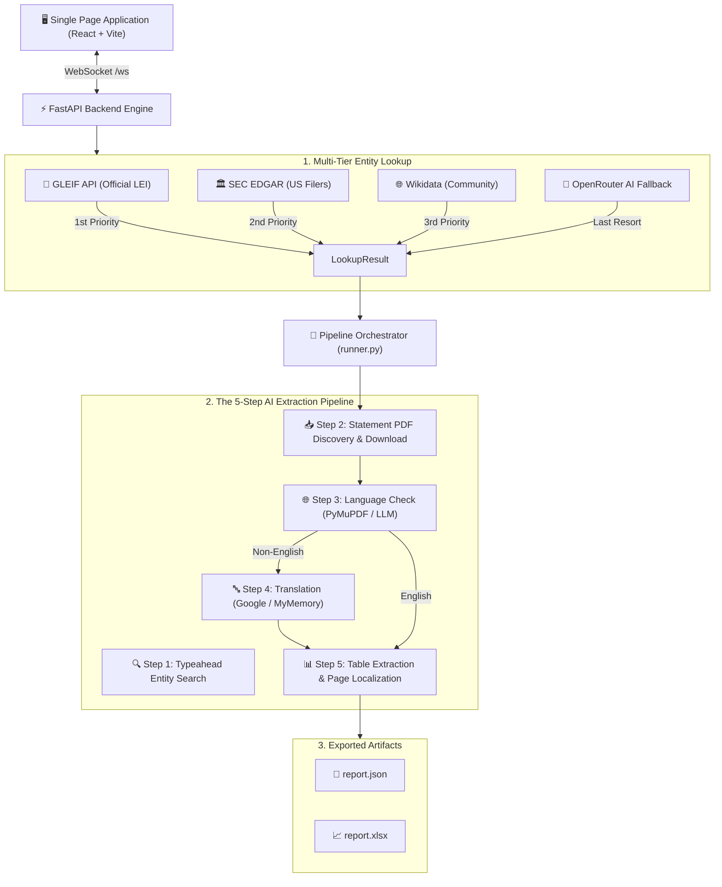

# 📊 ASB Finstat

### Real-Time Financial Statement Search, Translation & AI Extraction Engine
**Built by Team *Friendly Strangers* for Hackathon**

[](https://www.python.org/)
[](https://fastapi.tiangolo.com/)
[](https://react.dev/)
[](https://www.typescriptlang.org/)
[](https://vitejs.dev/)
[](https://openrouter.ai/)
[](LICENSE)

---

## 📌 Executive Summary

**ASB Finstat** is an autonomous, single-page web application that automates the retrieval, translation, and extraction of corporate financial statements.

Simply select a country and type a company name. An autonomous AI agent pipeline:

1. **Identifies the verified legal entity** across global registries (GLEIF, SEC EDGAR, Wikidata, AI).
2. **Locates and downloads financial statement PDFs** for the last 3 years.
3. **Detects document language** (handling encrypted & complex PDFs).
4. **Translates non-English statements** into English while preserving structural page boundaries.
5. **Extracts structured financial tables** (Balance Sheet, Income Statement, Cash Flow) into **JSON** and **Excel** formats.

Every state transition is **streamed live over WebSockets** to an interactive activity dashboard. Everything runs 100% locally on a single machine with **no cloud hosting, no databases, and zero infrastructure overhead**.

---

## 🏗️ System Architecture & Workflow



---

## 🏢 Multi-Tier Company Lookup Engine

Company lookup enforces a strict **resilience cascade**:
`GLEIF` → `SEC EDGAR (US)` → `Wikidata` → `AI Fallback`.

The first source returning valid records wins. Provider timeouts or empty responses automatically failover to the next source, ensuring zero pipeline lockup.

| Provider | Access & Requirements | Scope & Validation Rules | Caching & Deadlines |
| :--- | :--- | :--- | :--- |
| **GLEIF** | Free (No API key) | Official Legal Entity Identifiers (LEIs). Excludes funds, branches, inactive/annulled LEIs. Includes jurisdiction filtering. | 10-min cache, 8s timeout |
| **SEC EDGAR** | Free (`SEC_USER_AGENT` header) | US incorporated entities. Matches US state incorporation codes. | 10-min cache, 8s timeout |
| **Wikidata** | Free (No API key) | Community-verified global business entity records. | 10-min cache, 8s timeout |
| **AI Fallback** | OpenRouter (`MODEL_COMPANY_SEARCH`) | Last-resort fallback for unlisted/obscure entities. Explicitly tagged `unverified`. | 1-min cache, 25s timeout |

---

## 🤖 The 5 AI Orchestration Steps

Every AI step interacts through OpenRouter (`backend/app/openrouter.py`) and is individually configurable via `backend/.env`:

| # | Pipeline Step | Core Module | Default Model Config (`.env`) | Owner / Lead |
| :-: | :--- | :--- | :--- | :-: |
| **1** | Company Typeahead Fallback | `backend/app/pipeline/company_search.py` | `MODEL_COMPANY_SEARCH` | — |
| **2** | Find & Download Statement PDFs | `backend/app/pipeline/find_statements.py` | `MODEL_FIND_STATEMENTS` | — |
| **3** | Language Detection | `backend/app/pipeline/language_check.py` | `MODEL_LANGUAGE_CHECK` | **Adel** |
| **4** | PDF Translation to English | `backend/app/pipeline/translate.py` | Google Translate / MyMemory (No key required) | **Adel** |
| **5** | Financial Table Extraction | `backend/app/pipeline/statement_extractor.py` | `MODEL_EXTRACT` | **Sophie** |

> Downloaded source PDFs land in `backend/data/downloads/<company-slug>-<identity>/` (git-ignored).

---

## 📊 Financial Statement Extraction

The extraction module (`backend/app/pipeline/statement_extractor.py`):

- Reads document layouts using **PyMuPDF**.
- Locates statement pages and recovers underlying raw source tables.
- Employs **LLM-assisted page localization** (`EXTRACT_USE_LLM=true`) to pinpoint statement boundaries while preserving exact numeric figures from source tables.
- Applies **Tesseract OCR** (`EXTRACT_OCR_MODE=auto`) for scanned PDF fallback.
- Exports structured outputs to `backend/data/extractions/<id>/` in **JSON** (`report.json`) and **Excel** (`report.xlsx`).

---

## ⚡ Quickstart Guide

### 🚀 Option A: 1-Click Launcher (Recommended)

Run the single startup script from the project root:

- **Windows PowerShell:**
  ```powershell
  powershell -ExecutionPolicy Bypass -File .\startapp.ps1
  ```
- **macOS / Linux:**
  ```bash
  chmod +x ./startapp.sh
  ./startapp.sh
  ```

---

### 🛠️ Option B: Manual Step-by-Step Setup

#### 1. Backend Setup (FastAPI + Python 3.13)

```bash
cd backend

# Create & activate virtual environment
python -m venv .venv
# On Windows:
.\.venv\Scripts\activate
# On macOS/Linux:
source .venv/bin/activate

# Install dependencies
pip install -r requirements.txt

# Configure environment & API key
copy .env.example .env
# Edit backend/.env and set your OPENROUTER_API_KEY

# Test OpenRouter connection
python -m app.check_openrouter

# Start FastAPI backend server
uvicorn app.main:app --reload --port 8000
```

#### 2. Frontend Setup (Vite + React + TS)

```bash
cd frontend
npm install
npm run dev
```

Open **http://localhost:5173** in your browser.

---

## ⚙️ Configuration Reference (`backend/.env`)

```env
# OpenRouter API Key
OPENROUTER_API_KEY=sk-or-v1-...

# SEC Fair Access Contact (Optional, for US company lookups)
SEC_USER_AGENT=ASB Finstat your-email@example.com

# Model Overrides (Optional)
MODEL_COMPANY_SEARCH=openai/gpt-4o-mini
MODEL_FIND_STATEMENTS=perplexity/sonar
MODEL_LANGUAGE_CHECK=openai/gpt-4o-mini
MODEL_TRANSLATE=google/gemini-2.5-flash
MODEL_EXTRACT=anthropic/claude-sonnet-4.5

# Extractor Engine Settings
EXTRACT_USE_LLM=true
EXTRACT_OCR_MODE=auto
EXTRACTION_DIR=data/extractions
```

---

## 🔌 WebSocket API Protocol (`/ws`)

### Client → Server Messages

**Search Companies:**
```json
{
  "type": "search_companies",
  "country": "Germany",
  "countryCode": "de",
  "query": "Siemens",
  "requestId": 1
}
```

**Run Pipeline:**
```json
{
  "type": "run_pipeline",
  "country": "Germany",
  "company": {
    "id": "gleif:39120056057L3B11L161",
    "name": "Siemens AG",
    "source": "GLEIF"
  }
}
```

### Server → Client Messages

**Live Progress Update:**
```json
{
  "type": "step_update",
  "step": "extract",
  "status": "running",
  "message": "Extracting financial tables from 2024 annual report...",
  "data": null
}
```

---

## 🧪 Automated Testing & Verification

Run backend unit tests (mocked HTTP, 0 API credit cost):

```powershell
cd backend
.\.venv\Scripts\python.exe -m unittest discover -s tests -v
```

Run frontend typechecking and production build:

```powershell
cd frontend
npx tsc --noEmit
npm run build
```

---

## 📂 Project Directory Structure

```
asb-finstat-main/
├── .github/                  # CI/CD Workflows & Issue Templates
│   └── workflows/ci.yml
├── backend/                  # FastAPI Core Backend
│   ├── app/
│   │   ├── main.py           # FastAPI entrypoint & WebSocket handler
│   │   ├── config.py         # Pydantic Settings
│   │   ├── openrouter.py     # OpenRouter HTTP Client
│   │   ├── company_sources.py# GLEIF / SEC / Wikidata search logic
│   │   └── pipeline/         # 5-step processing pipeline modules
│   ├── data/                 # Downloaded PDFs & extractions (Git-ignored)
│   ├── tests/                # Comprehensive unit test suite
│   ├── .env.example          # Environment variable template
│   └── requirements.txt
├── frontend/                 # React + TypeScript + Vite UI
│   ├── src/                  # Components, Hooks, WebSocket connection
│   ├── index.html
│   └── package.json
├── docs/                     # Technical research & provider specifications
├── startapp.ps1              # 1-Click PowerShell launcher
├── startapp.sh               # 1-Click Bash launcher
├── CONTRIBUTING.md           # Developer contribution guidelines
├── SECURITY.md               # Security policy & disclosure
└── LICENSE                   # MIT License
```

---

## 📋 Pipeline Contracts & Team Ownership

The 5-step pipeline uses explicit modular contracts orchestrating language detection, translation, and table extraction:

- **Adel (Steps #3 & #4) — AI Language Detection & Translation Gates:**
  - **`language_check.py` (`async check_language(path, emit) -> dict`)**: Inspects PDF structure with PyMuPDF/PyPDF (handling AES-encrypted PDFs), calling `MODEL_LANGUAGE_CHECK` to identify language. Routes English documents directly to extraction (#5) and non-English files to translation (#4).
  - **`translate.py` (`async translate_pdf(path, language, emit) -> Path`)**: Translates non-English PDFs to English text while strictly preserving page boundary markers, using the dual Google Translate / MyMemory translation engine in `pdf_translation.py`.
- **Sophie (Step #5) — Financial Statement Extractor:**
  - **`extract.py` (`async extract_statements(path, emit) -> dict`)**: Takes English PDFs or translated text reports, recovering source table grids and exporting `report.json` and `report.xlsx`.

---

## 👥 Team & Attribution

Developed with ❤️ by **Friendly Strangers** for Hackathon:
- **Adel**: AI Language Detection Gate (`#3`), Translation Pipeline Engine (`#4`) & Multilingual PDF Processing.
- **Sophie**: Financial Statement Extractor Engine (`#5`), Table Localization & Output Generator.

### 🙏 Special Thanks & Acknowledgements
Special thanks to **Bashir** for invaluable contributions, leadership, and guidance throughout the development of this project.

---

## 📜 License


Distributed under the **MIT License**. See [LICENSE](LICENSE) for details.